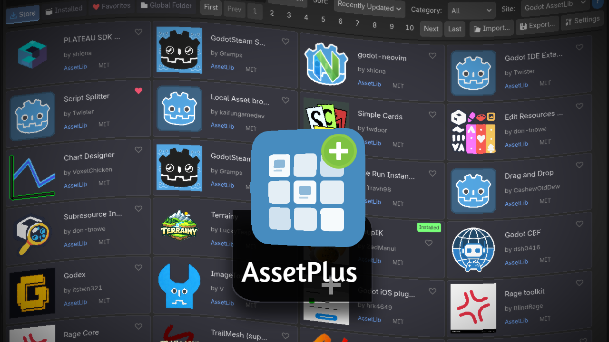
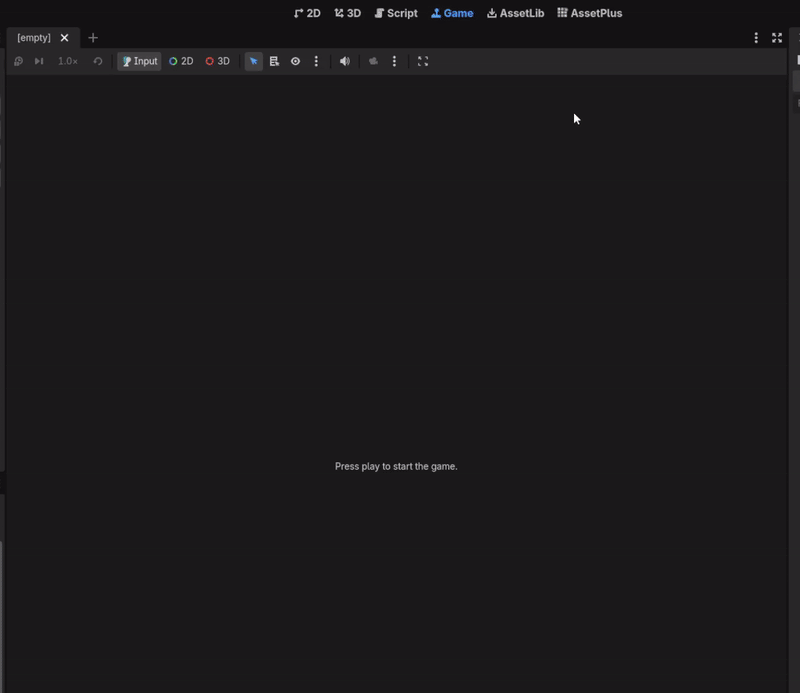

<p align="center">
  
</p>

<p align="center">
  <a href="https://godotengine.org/"></a>
  <a href="LICENSE"></a>
  <a href="https://github.com/moongdevstudio/AssetPlus/releases"></a>
  <a href="https://moongdevstudio.github.io/AssetPlus/"></a>
</p>

<p align="center">A unified asset browser for Godot 4.x that brings together multiple asset sources into one powerful interface.</p>

<p align="center">
  <a href="https://www.youtube.com/watch?v=ioUR2K8xtNE">
    
  </a>
</p>
<p align="center"><a href="https://www.youtube.com/watch?v=ioUR2K8xtNE">▶️ Watch the full demo video on YouTube</a></p>

## Features

| Feature | Description |
|---------|-------------|
| **Multi-Source Browser** | Search Godot AssetLib, Godot Store Beta & Godot Shaders in one place |
| **One-Click Install** | Install addons, templates, or full demo projects with selective import |
| **Installed Tracking** | See all addons in your project with source matching |
| **Addon Updates** | Get notified when updates are available for your installed addons |
| **Global Library** | Build a personal collection of reusable assets as `.godotpackage` files |
| **Favorites Sync** | Save favorites, synced across all projects |
| **Auto-Update** | AssetPlus updates itself automatically |

### Browse Multiple Sources
- **Godot AssetLib** - Official Godot Asset Library
- **Godot Store Beta** - New Godot store (store-beta.godotengine.org)
- **Godot Shaders** - Community shaders from godotshaders.com (browse only, redirects to site)

### Global Asset Library
Build your personal asset collection:
- Export any folder or addon as a `.godotpackage` file stored locally
- Store packages in a central **Global Folder**
- Install your packages into any project
- Right-click export from FileSystem dock

### Smart Installation
Similar to Unity's package import, you get full control when installing templates or demo projects:
- Choose which files/folders to import with a file tree view
- Filter by file type (Scripts, Scenes, Images, etc.)
- Optionally import input actions and autoloads
- Preview what will be added to your project


### Addon Updates
Keep your installed addons up to date:
- Automatic update detection for addons from AssetLib and Godot Store Beta
- Update badges on cards and in detail view
- One-click update installation

### Auto-Update
AssetPlus checks for its own updates at startup and notifies you when a new version is available. Install updates with one click, or disable auto-update in Settings.

## Installation

1. Download the [latest release](https://github.com/moongdevstudio/AssetPlus/releases)
2. Copy `addons/assetplus` to your project's `addons` folder
3. Enable in **Project Settings > Plugins > AssetPlus**
4. Access from the top toolbar (next to 2D, 3D, Script)

## Quick Start

1. **Browse** - Search assets in the Store tab
2. **Install** - Click any asset, then Install
3. **Export** - Right-click a folder > "Export as .godotpackage"
4. **Settings** - Configure your Global Folder for personal asset library

## .godotpackage Format

A portable package format for sharing Godot assets:
```
package.godotpackage
├── manifest.json    # Metadata (name, version, author, etc.)
├── icon.png         # Optional icon
└── files/           # Package contents
```

## Requirements

- Godot 4.3+
- Editor plugin only (not included in exports)

## License

MIT License - See [LICENSE](LICENSE)

## Links

- [Documentation](https://moongdevstudio.github.io/AssetPlus/)
- [Releases](https://github.com/moongdevstudio/AssetPlus/releases)
- [Report Issues](https://github.com/moongdevstudio/AssetPlus/issues)

---
Developed by MoongDevStudio
