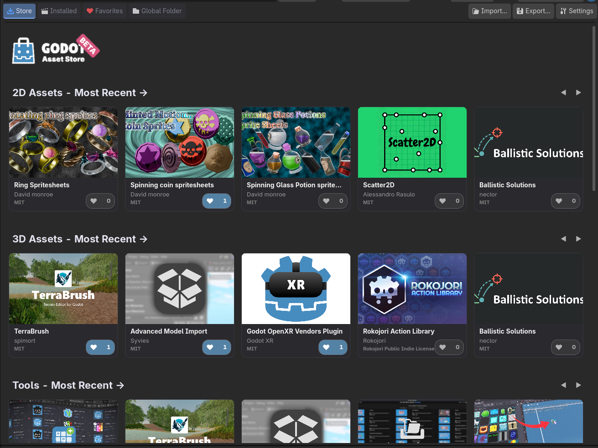

# Store Browser

The Store Browser lets you search and browse assets from multiple sources in one unified interface.

## Home Page

The Home page is the default landing page that displays curated content from all stores:

- **Categorized sections** from each store (AssetLib, Store Beta, Godot Shaders)
- **Horizontal carousels** showing assets by category
- **Store logos** to identify the source of each section
- **Priority loading** - first 3 categories load instantly

## Available Sources

### Godot Asset Library

The official Godot Asset Library at [godotengine.org/asset-library](https://godotengine.org/asset-library/).

- Full support for browsing, searching, and installing
- Assets are downloaded and extracted directly into your project

### Godot Store Beta

The new Godot store at [store-beta.godotengine.org](https://store-beta.godotengine.org/).

- Browse assets from the new store interface
- Full installation support

### Godot Shaders

Community shaders from [godotshaders.com](https://godotshaders.com/).

- Browse and search shaders
- **Browse only** - clicking on a shader redirects to the website
- Copy shader code manually from the site

## Searching

Use the search bar at the top to find assets:

- Search by name, description, or tags
- Results update as you type
- Search works across all sources

## Filtering & Sorting

Use the category dropdown to filter assets by type:

- Templates, Projects, Demos
- Addons, Scripts, Tools

Use the sort dropdown to order results:

- **Newest** - Most recently updated
- **Most Liked** - Assets with the most likes from the community

## Likes System

Like your favorite assets and discover what's popular:

- Click the **heart icon** on any asset card to like it
- Likes are **synced to a cloud server** shared by all AssetPlus users
- Your likes are remembered across all your Godot projects
- Sort by "Most Liked" to see popular assets
- No account required - your device is identified anonymously

## Asset Cards

Each asset is displayed as a card showing:

- Thumbnail image
- Asset name
- Author
- Category
- Like count and heart icon

Click on any card to view full details.

## Asset Details

The detail view shows:

- Full description
- Version information
- Download size
- Screenshot gallery
- Installation button
- Favorite and Like buttons

### Image Gallery

Click on any screenshot in the detail view to open the full-screen image gallery:

- Navigate with arrow keys or click arrows
- Press Escape to close
- View images at full resolution

## Disabling Sources

You can enable or disable individual sources in [Settings](../reference/settings.md). This is useful if you only want to browse specific stores.
